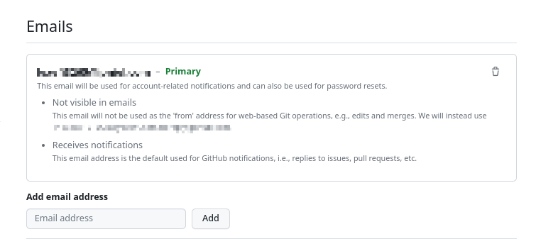

# Free Software

This guide will show how to claim GitHub Pro and JetBrains products for free using your Great Neck Students Email.

> [!IMPORTANT]
> You need a valid school email ending with `@student.gn.k12.ny.us`.

**If you have any questions, please ping Jack M on the [club Discord server](https://discord.gg/dZ2q3gaPjB)**.

**Click the following dropdowns to get started to view the necessary steps.**

# #1 GitHub sign up</strong>

**IT IS HIGHLY RECOMMENDED YOU FOLLOW THIS GUIDE EXACTLY IF YOU HAVE NEVER USED GITHUB BEFORE**

This is straightforward, you are most likely reading on the website already. If you have not go sign up for a GitHub account [here](https://github.com/signup?ref_cta=Sign+up&ref_loc=header+logged+out&ref_page=%2F&source=header-home).

We will be using GitHub for sharing code and also publishing our code.

### Enter Email

For this part, please input a ***NON SCHOOL EMAIL***. This means one of your emails that you are using. It might end in `@gmail.com`, `@yahoo.com`, etc..

Click <kbd>Continue</kbd>

### Personal Information

Create your password, use a secure one.

### Username

Create a username that you like.

*Note:* This does not have to be your real name.

### Product Emails

This is your own choice.

### Verify CAPTCHA

This is a verified CAPTCHA, just do as it says.

You have to go through with validating your email.

### Selecting your fields

You can select what you want, BUT for the ease of this guide, please sign up with the following parameters:

1. **How many team members will be working with you?** `Just me`
2. **Are you a student or teacher?** `Student`

You will then be prompted with the following:

You can click on anything you want, but preferably none of them.

### Applying for Student Benefits

Click <kbd>Apply for your GitHub Student benefits</kbd>

Click <kbd>Sign up for Student Developer Pack</kbd>

### Apply as a Student Individual

Click <kbd>Get student benefits</kbd>

### Entering your information for the fields

Scroll down until you see this block of information:

Click <kbd>+ Add an email address</kbd>

You should be prompted with the following:

> Please add and verify your school-issued email address in your account settings – or a contact email if you do not have one. Once your email is verified, refresh this page.

Click on `add and verify...` and you should be led to a page, look for this block:

Click under `Add email address` <kbd>Add</kbd> and put your SCHOOL EMAIL, the one that ends in `@student.gn.k12.ny.us`.

It will ask you to verify the account. Go to your school email and verify the account. The email looks something like the following:

Press <kbd>Verify email address</kbd>

Head back and make sure your school email is listed something like this:

### Head back to the form

If you lost the page, you can find it [here](https://education.github.com/discount_requests/application)

Scroll until you resume at this location:

### Fields filling out

Please check the one that is the HIGH SCHOOL, not the MIDDLE SCHOOL.

### How do you plan to use GitHub?

This is a generic answer, but you should keep it like 2-3 sentences that revolve around:
* Using it to contribute to the Great Neck Game Design Club
* Writing code and collaborating with others
* Publish code for Games developed

etc...

*It isn't a college essay, but be professional.*

After that, **click <kbd>Continue</kbd>**

### Next form

You might be prompted by your browser to allow GitHub to use your location. **You must allow in order for GitHub to verify the validity of your attendance at GNSHS**

The next page is a page (I sadly do not have any pictures of this form) where you must submit an identification form. **Just take a picture of your SCHOOL ID that is clear and visible on the FRONT where it has your face.**

Then you should be able to press a button related to `Process my application`.

### Waiting for results

There are two possible results.

**If you end up with a rejected, please contact exoad**

Let the application process in the meantime.
